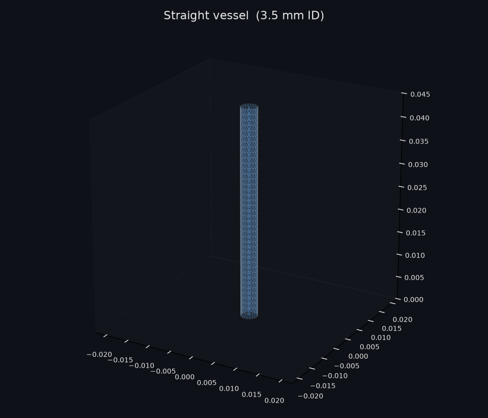
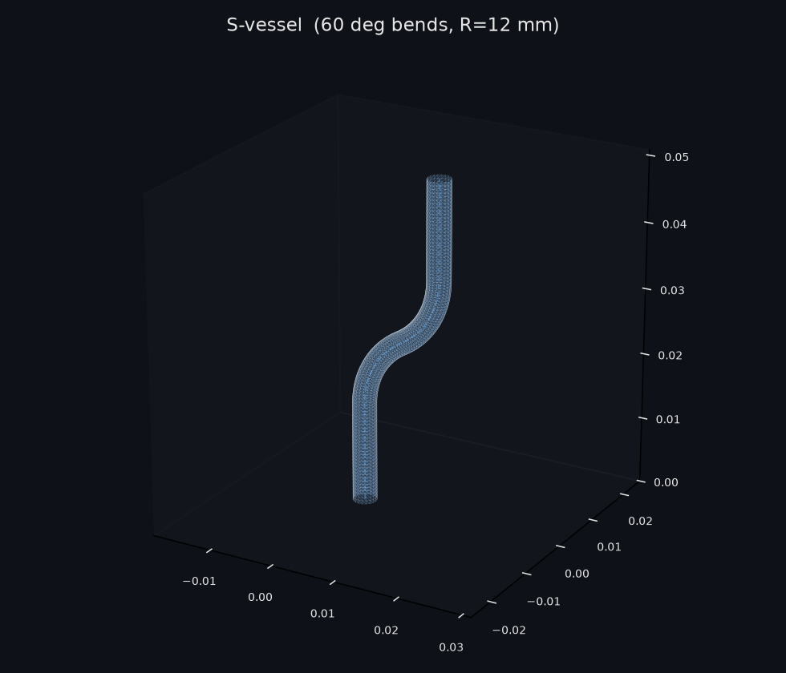
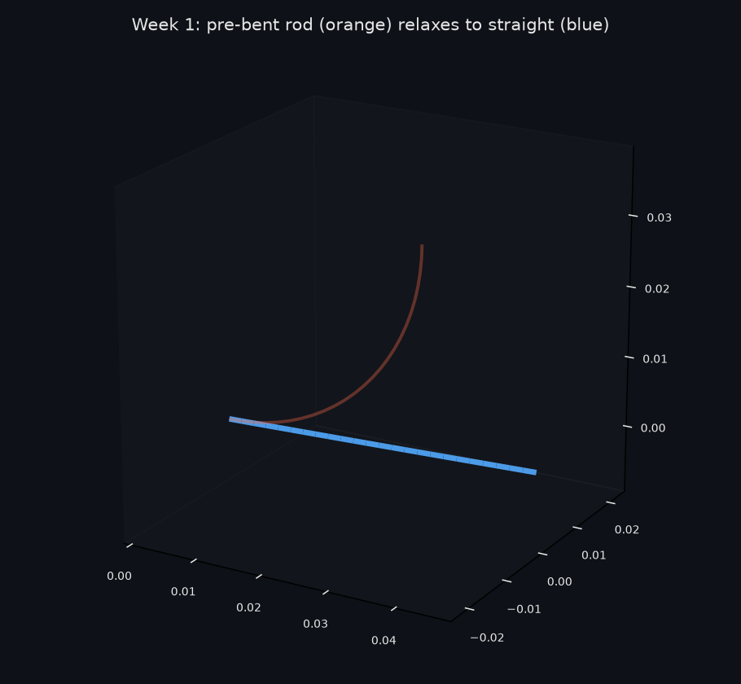
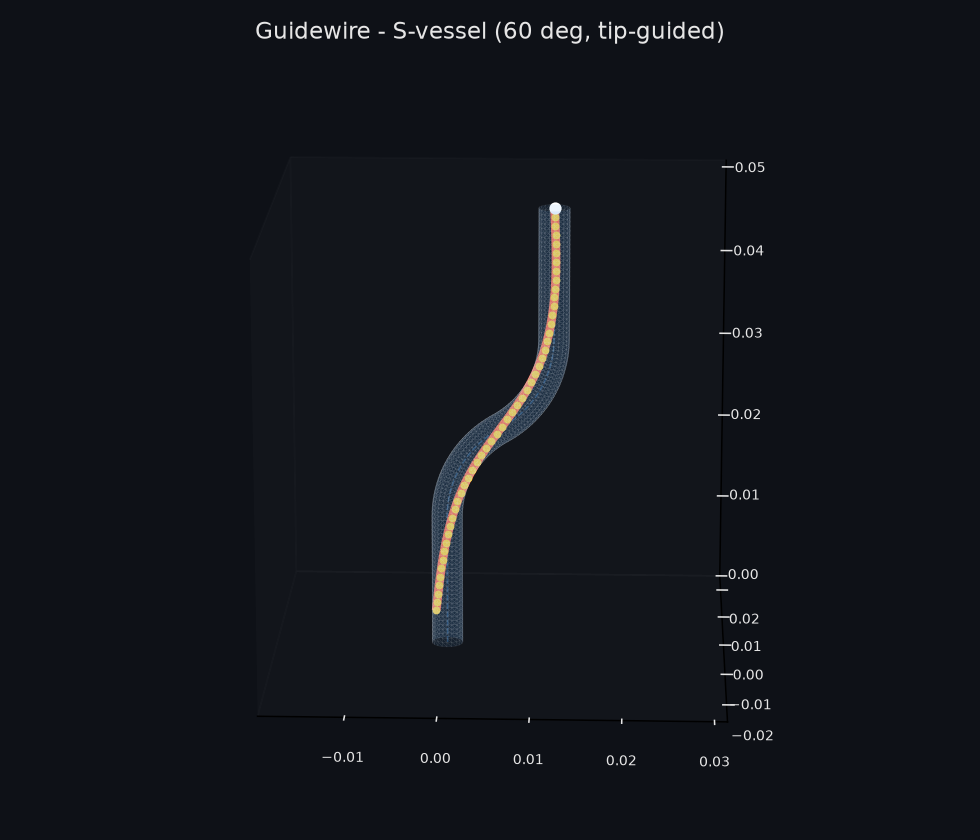
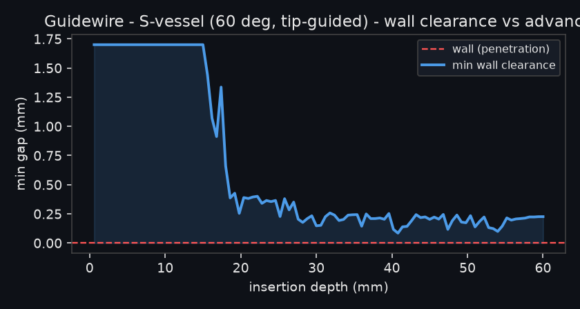

# C-IPC Cosserat Rod in NVIDIA Warp — Week 1 & 2 Report

**Project:** `sim-fold-ipc` — Incremental Potential Contact (IPC) solver for
endovascular guidewire navigation.
**Milestones covered:** Week 1 (rod kinematics) and Week 2 (mesh coupling &
broad-phase + contact).
**Compute:** CPU-only box (no CUDA driver); all Warp kernels run on the CPU
backend. Code is device-agnostic and uses the GPU automatically where present.

---

## 1. Results at a glance

| Deliverable | Status |
| :--- | :--- |
| uv project + device-agnostic Warp scaffolding | ✅ |
| Two vessel meshes (straight + S, 60° bends), neural scale, validated | ✅ |
| Differentiable rod energies + **autodiff gradients verified vs finite diff** | ✅ |
| IPC log-barrier contact on Warp `wp.Mesh` BVH broad-phase | ✅ |
| Incremental-potential solver (overdamped, modified Newton) | ✅ |
| **Week 1** — pre-bent rod relaxes to straight (monotone energy) | ✅ PASSED |
| **Week 2** — guidewire navigates both vessels, **zero wall penetration** | ✅ PASSED |
| Full quaternion-Cosserat model | ⚠️ implemented + gradient-verified; stiff solve deferred (§6) |

Both validation suites pass: `tests/test_rod_freespace.py` (Week 1) and
`tests/test_navigation.py` (Week 2).

---

## 2. The two vessel meshes

Neural vessels are 2–5 mm in diameter; both meshes use a **3.5 mm inner
diameter** (1.75 mm radius). Meshes are generated by sweeping a circular
cross-section along a centreline with **rotation-minimising frames**
(double-reflection method) so the tube accumulates no spurious twist.

| Straight vessel | S-vessel (two opposite 60° bends) |
| :---: | :---: |
|  |  |

The S is built as *straight → +60° arc → −60° arc → straight* at a 12 mm
centreline bend radius. Orbit movies (GIF):
[straight](../images/straight_tube_orbit.gif) ·
[S-vessel](../images/s_tube_orbit.gif).

**Validation** (`tests/test_meshes.py`): wall radius accurate to <0.1 %, 100 %
outward-facing normals, and S-tube end tangents parallel to $\cos\theta>0.99$
(net turn $+60^\circ-60^\circ=0$).

---

## 3. Week 1 — rod kinematics (free space, no gravity)

Endovascular motion is gravity-free and quasi-static, so kinematics are
validated by **release-and-relax**: pre-bend the rod into a 90° arc, clamp the
base, release overdamped, and require it to return to its straight rest shape.



Result (`tests/test_rod_freespace.py`): total turning angle
$86.25^\circ \rightarrow 0.17^\circ$, elastic energy decays by **~8 orders of
magnitude** and monotonically, stretch stays $<0.1\%$ (effectively
inextensible), base stays clamped. **PASSED.**

---

## 4. Week 2 — IPC navigation (mesh coupling + contact)

### 4.1 Actuation
Per the agreed scheme, the proximal end is snapped to a straight **rail** at the
inlet and driven at **constant speed**:

* **Straight vessel — push-feed.** Every not-yet-entered node is pinned to the
  rail (sliding forward, no lateral deviation) and released into free contact
  only once fed safely inside the straight entry section. Pinning the outside
  span is what prevents "you-can't-push-a-string" buckling — the rod stays
  centred (min clearance ≈ 1.28 mm the whole way).
* **S-vessel — tip-guided.** A naive straight push *jams* at the reverse (second)
  bend — which is physically correct, and why real interventionists use shaped /
  steerable tips and rotation. So the distal tip tracks the vessel centreline at
  constant speed (a steerable tip) while the body follows and is held inside the
  lumen **purely by the IPC barrier + CCD**.

### 4.2 Navigation through the S-vessel
The guidewire threads the full S, hugging the inner walls through both bends,
with the minimum wall clearance **never reaching zero**:

| Guidewire in the S-vessel | Wall clearance vs. advance |
| :---: | :---: |
|  |  |

Movie: [GIF](../images/nav_s.gif). Straight-vessel run:
[PNG](../images/nav_straight.png) · [GIF](../images/nav_straight.gif).

Result (`tests/test_navigation.py`): min gap **+0.067 mm** (S) and **+1.60 mm**
(straight) — strictly positive throughout ⇒ **zero penetration.** The clearance
plot is the IPC guarantee made visible: the log-barrier repels the rod as it
nears a wall, so the curve dips into the bends but never crosses the red
penetration line.

---

## 5. Physics & mathematics

### 5.1 Incremental potential (implicit, overdamped)
Each step minimises over node positions

$$
E(\mathbf{x}) = \underbrace{\frac{1}{2h^2}\sum_i m_i\lVert \mathbf{x}_i-\mathbf{x}_i^{\text{prev}}\rVert^2}_{\text{proximal / inertia}}
 + E_{\text{stretch}} + E_{\text{bend}} + \kappa\,B(\mathbf{x}) .
$$

The overdamped prediction (no momentum carry-over) makes the relaxation
unconditionally stable and monotone — the correct regime for quasi-static
navigation. Gradients come from Warp reverse-mode autodiff; the step is a
dense **modified-Newton** (FD Hessian, LM-regularised, reused across inner
iterations), which handles the stiff, coupled system that defeats first-order
methods.

### 5.2 Elastic energy (positions-primary / Discrete Elastic Rods)
Bending acts on the *centreline* through the discrete curvature binormal at
interior node $i$,

$$
(\kappa\mathbf{b})_i = \frac{2\,\mathbf{e}_{i-1}\times\mathbf{e}_i}
{\lVert\mathbf{e}_{i-1}\rVert\lVert\mathbf{e}_i\rVert + \mathbf{e}_{i-1}\!\cdot\mathbf{e}_i},
\qquad
E_{\text{bend}} = \sum_i \frac{k_b}{\bar\ell_i}\,\lVert(\kappa\mathbf{b})_i\rVert^2 ,
$$

with $\mathbf{e}_i=\mathbf{x}_{i+1}-\mathbf{x}_i$. Stretch is a near-inextensible
spring $E_{\text{stretch}}=\tfrac12\sum_i k_s(\lVert\mathbf{e}_i\rVert-\ell_i)^2/\ell_i$.
This is well-conditioned (bending drives the centreline directly), unlike the
quaternion-Cosserat coupling (§6).

### 5.3 IPC log-barrier contact
For each node let $d$ be the unsigned distance to the closest point on the
vessel wall (Warp BVH `wp.mesh_query_point`) and $g=d-r_{\text{rod}}$ the gap:

$$
B(g)=\begin{cases}-(g-\hat d)^2\ln(g/\hat d), & 0<g<\hat d,\\ 0,& g\ge\hat d.\end{cases}
$$

The closest face is frozen inside the kernel, so autodiff returns the exact IPC
contact force $-\partial B/\partial\mathbf{x}$. Non-penetration is enforced by a
conservative **CCD cap** on the committed step (no node advances more than half
its current clearance).

### 5.4 Is this C-IPC?
It implements the **IPC methodology**: incremental potential + the $C^2$
log-barrier + a codimensional **thickness offset** (the rod radius $r_{\text{rod}}$
turns the zero-thickness centreline into a finite-radius primitive) + CCD-filtered
stepping for a guaranteed intersection-free trajectory. It is a **simplified
node-to-surface variant**, *not* the full codimensional C-IPC of Li et al. 2021:
contact is **point (node) vs. triangle** only — no edge–edge / point–edge pairs
and no rod self-contact — and CCD is conservative node-advancement rather than
exact additive CCD. Those are the natural Week-3 upgrades.

### 5.5 Material (SolitaireX 5Fr reference)
Nitinol $E\approx 60\,\text{GPa}$, $\nu=0.33$, $\rho\approx 6450\,\text{kg/m}^3$;
stiffnesses $EA,\,GA,\,EI,\,GJ$ with $I=\tfrac{\pi}{4}r^4$, $J=2I$. The navigation
demos use a slender flexible core so the wire conforms to the neuro-vessel bends.

---

## 6. Engineering log — bugs hit and how they were fixed

1. **NaN gradients from `sqrt(0)`** in the quaternion exp-map at the predicted
   state ($\phi=0$): the adjoint of $\sqrt{\cdot}$ is infinite there. Fixed with
   $\theta=\sqrt{\lVert\phi\rVert^2+\varepsilon}$.
2. **Rod free-fell / stretched 3×** independent of stiffness: the hand-rolled
   L-BFGS used $\gamma=1/\lVert g\rVert$ as the initial Hessian, giving unit-metre
   first steps and sub-nm accepted steps. Replaced with a diagonal preconditioner.
3. **Line search saw no energy change** (`de=0`): $\sim10^{-6}\,\text{J}$ energy in
   **float32** has $\sim10^{-13}$ resolution. Fixed by accumulating energy in
   **float64**.
4. **Gradient verified**: finite-difference check matched autodiff to
   $7\times10^{-4}$ relative error.
5. **Quaternion-Cosserat stiff solve** — the crux. Stretch/shear is $\sim A/I\approx
   10^{7}\text{–}10^{8}$ times stiffer than bending, so the Hessian is ~$10^8$-
   conditioned and strongly couples positions↔orientations. First-order methods
   (even SciPy L-BFGS-B) stall at `nit=0`; softening the stiff modes lets them move
   but *decouples the frames from the centreline* (bending straightens the frames
   without moving the nodes). **Resolution:** switch the working model to the
   **positions-primary DER rod** (§5.2), where bending drives the centreline
   directly and the system is well-conditioned. The full Cosserat kernels remain in
   the repo (`elasticity.py`), gradient-verified, for a future Newton/float64 upgrade.
6. **Momentum instability** — carrying angular velocity into the prediction
   over-rotated the state and injected energy. Fixed by the overdamped
   (quasi-static) formulation, which also matches the physical regime.
7. **Push-buckling** — pinning only a few proximal nodes left the outside span
   unsupported; it buckled. Fixed by the rail constraint (pin the whole
   not-yet-entered span). The remaining tip-jam at the reverse bend is real
   physics, handled by tip-guided actuation.
8. **Solver too slow** — rebuilding the FD Hessian every Newton iteration.
   Fixed with modified Newton (build once per step, refresh every 5 iters):
   ~35 s for a 100-step S-navigation on CPU.

---

## 7. Repository layout
```
sim_fold_ipc/
  meshes.py        vessel mesh generation (+ OBJ export)
  rod.py           rod state, params, initialisation
  elasticity.py    full quaternion-Cosserat energy kernels (gradient-verified)
  elastic_pos.py   positions-primary (DER) energy kernels  [working model]
  barrier.py       IPC log-barrier + BVH gap queries
  solver.py        Cosserat incremental-potential solver (stiff-solve WIP)
  solver_pos.py    positions-primary overdamped modified-Newton solver [used]
  navigate.py      rail push-feed + tip-guided actuation
  render.py        matplotlib PNG / MP4 / GIF rendering
scripts/           render_meshes.py, demo_navigation.py
tests/             test_meshes, test_rod_freespace (W1), test_navigation (W2)
images/  reports/  assets/
```

## 8. Next steps (Week 3)
1. Upgrade contact to full C-IPC primitives: **edge–edge** and **point–edge**
   pairs + **rod self-contact**, with exact additive CCD.
2. Bring the **quaternion-Cosserat** model online via a Newton solve on the true
   (float64) Hessian, adding **twist** actuation (constant rotation rate).
3. Friction (IPC smooth stick-slip) and the XPBD benchmark comparison.
